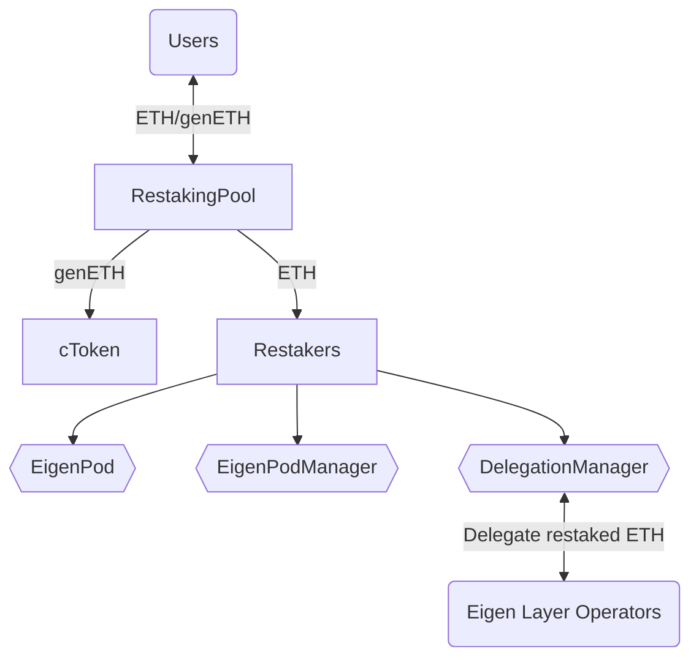

# Genesis liquid restaking
[Website](https://www.genesislrt.com/) | [Docs](https://docs.genesislrt.com/)

## Overview
Genesis liquid restaking is implemented as a collection of smart contracts, both Genesis and third-party (EigenLayer).
Genesis liquid restaking supports ETH as the input asset to stake it to Beacon Chain and enable restaking mechanics using EigenLayer to produce extra rewards to the users.

### Contracts
#### Genesis
* **cToken** - implementation of genETH token; not rebased.
* **RestakingPool** - the pool that implements such features as exchange ETH to genETH and vice versa; owner of Restakers assigned to different providers.
* **RatioFeed** - contract stores ratio between ETH and genETH.
* **ProtocolConfig** - contract stores general variables of liquid restaking protocol.
* **FeeCollector** - contract receives Tips & Mev rewards for produced blocks. Must be set as --fee-recipient in validator client.
* **Restaker** - owner and deployer of EigenPod; Restaker features transferable ownership.
* **RestakerFacets** - contract stores dependencies between method signature and target contract. See [Diamond](https://eips.ethereum.org/EIPS/eip-253).
* **RestakerDeployer** - a contract that deploys instances of the `Restaker` contract.
#### EigenLayer
* **EigenPod** - a contract that serves as the withdrawal credentials for one or more Beacon Chain validators controlled by a `Restaker`. The primary role is to validate Beacon Chain proofs for each of the `Restaker`'s validators.
* **EigenPodManager** — entry point for `EigenPod`.
* **DelegationManager** — a contract that manages delegations to one of EigenLayer Node Operators, where the operators are legal entities who offer to run actively validated services software modules on the stakers' behalf

## Installation

### Prerequisites
* Node: v16+

### Tasks
#### Compilation
`yarn hardhat compile`
#### Tests
`yarn hardhat test`
#### Deploy
`yarn hardhat deploy`
