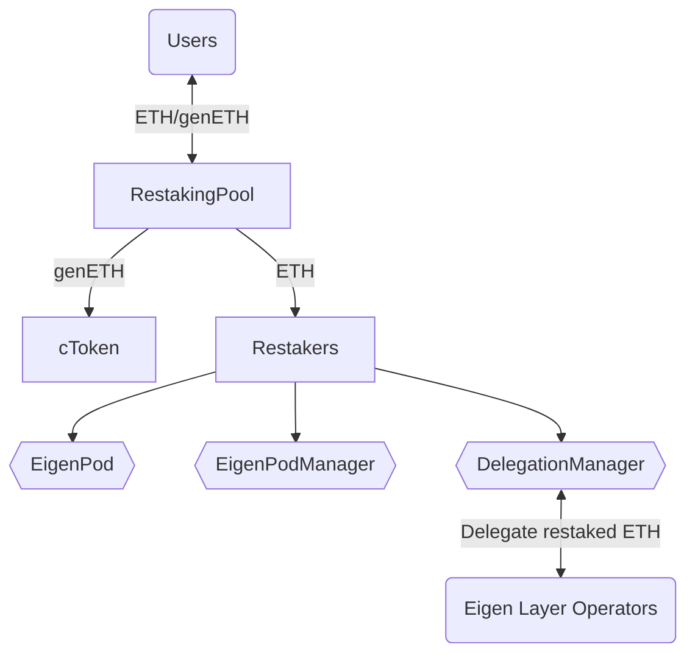

# Genesis liquid restaking
[Website](https://www.genesislrt.com/) | [Docs](https://docs.genesislrt.com/)

## Overview
Genesis liquid restaking is implemented as a collection of smart contracts, both Genesis and third-party (EigenLayer).
Genesis liquid restaking supports ETH as the input asset to stake it to Beacon Chain and enable restaking mechanics using EigenLayer to produce extra rewards to the users.

### Contracts
#### Genesis
* **cToken** - implementation of genETH token; not rebased.
* **RestakingPool** - the pool that implements such features as exchange ETH to genETH and vice versa; owner of Restakers assigned to different providers.
* **RatioFeed** - contract stores ratio between ETH and genETH.
* **ProtocolConfig** - contract stores general variables of liquid restaking protocol.
* **FeeCollector** - contract receives Tips & Mev rewards for produced blocks. Must be set as --fee-recipient in validator client.
* **RestakerBeacon** - beacon of Restaker.
* **Restaker** - owner and deployer of EigenPod; Restaker features transferable ownership.
* **RestakerFacets** - contract stores dependencies between method signature and target contract. See [Diamond](https://eips.ethereum.org/EIPS/eip-253).
* **RestakerDeployer** - a contract that deploys instances of the `Restaker` contract.
#### EigenLayer
* **EigenPod** - a contract that serves as the withdrawal credentials for one or more Beacon Chain validators controlled by a `Restaker`. The primary role is to validate Beacon Chain proofs for each of the `Restaker`'s validators.
* **EigenPodManager** — entry point for `EigenPod`.
* **DelegationManager** — a contract that manages delegations to one of EigenLayer Node Operators, where the operators are legal entities who offer to run actively validated services software modules on the stakers' behalf

## Deployments
### Goerli
* StakingPool: https://goerli.etherscan.io/address/0x98870b62aac7503383048be97299286c23dd3f52
* CertificateToken: https://goerli.etherscan.io/token/0x51046e9a40e217fb63f27440e8e7949bbacf9309
* StakingConfig: https://goerli.etherscan.io/address/0x4dec37ba2750f4af8739fd6aceb829ea352d0bec
Goerli V1:
* StakingPool: 0x98870b62Aac7503383048BE97299286c23dD3F52
* StakingConfig: 0x4dEC37ba2750F4Af8739Fd6aCeB829eA352D0bEc
* RestakerFacets: 0xd226a5359235F3DF49E1f1483d3d65BC084b4527
* RestakerDeployer: 0x4df3C590B25299B7dc0588F7D316fc3D137D562C
* FeeCollector: 0x7C478ad33773E4A4Fa307e007448f21b7d99E4d6
* CertificateToken: 0x51046E9a40E217Fb63f27440e8E7949bbAcF9309
Mainnet V1:
* Restaker Beacon: https://etherscan.io/address/0x82d87f4c7171cabb9ac55ae3f60f7d15f595a46a
* ProtocolConfig: https://etherscan.io/address/0x81b98D3a51d4aC35e0ae132b0CF6b50EA1Da2603
* RatioFeed: https://etherscan.io/address/0x122ee24Cb3Cc1b6B987800D3B54A68FC16910Dbf
* cToken: https://etherscan.io/address/0xf073bAC22DAb7FaF4a3Dd6c6189a70D54110525C
* RestakingPool: https://etherscan.io/address/0x46199cAa0e453971cedf97f926368d9E5415831a
* FeeCollector: https://etherscan.io/address/0xf403eb7B69F6c7Ab73BBaeF42AFE87c0a61a15D0
* RestakerFacets: https://etherscan.io/address/0x161Cd8fD2694D220e246854E177B726D8E36971d
* RestakerDeployer: https://etherscan.io/address/0x10ccB7aFb5C2C20fffA38eAf1FbC99db571Bf57A

## Installation

### Prerequisites
* Node: v16+

### Tasks
#### Compilation
`yarn hardhat compile`
#### Tests
`yarn hardhat test`
#### Deploy
`yarn hardhat deploy`
